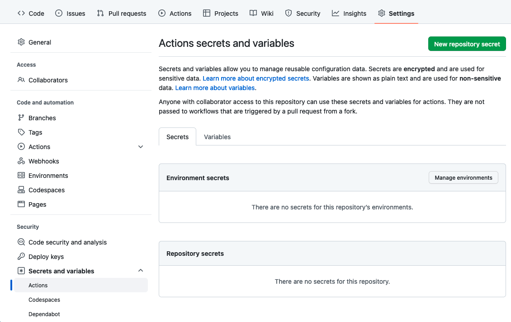

# Container registries

Building a Docker image in a GitHub action is very simple, however generating an appropriately tagged image and authenticating and pushing to a container registry is more complicated.

## Docker Hub - docker.io

To push to Hocker Hub from an Action secret environment variables are used. e.g.

```sh
username: ${{ secrets.DOCKER_HUB_USERNAME }}
password: ${{ secrets.DOCKER_HUB_ACCESS_TOKEN }}
```

And set a secret in the repository settings.



## GitHub Container Registry - ghcr.io

The GitHub container registry avoids having to set secret variables as we can get the username and password using the built in GITHUB_TOKEN
 
```
username: ${{ github.actor }}
password: ${{ secrets.GITHUB_TOKEN }}
```

To pull an image from any repository other than docker.io requires that the full name is used. e.g.

```msaunby/building-docker-containers-in-github:latest``` and ```docker.io/msaunby/building-docker-containers-in-github:latest``` are equivalent.

GitHub registry

```ghcr.io/msaunby/building-docker-containers-in-github:latest```

Google 

```gcr.io```

Azure

```{myregistry}.azurecr.io```

AWS

```public.ecr.aws``` Private registries have more complicated names.


