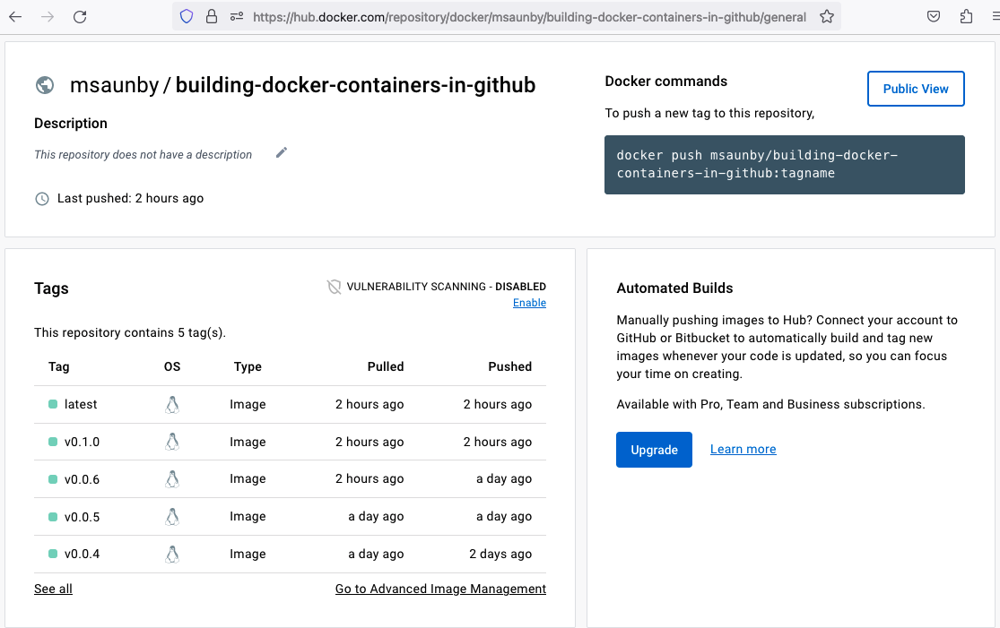
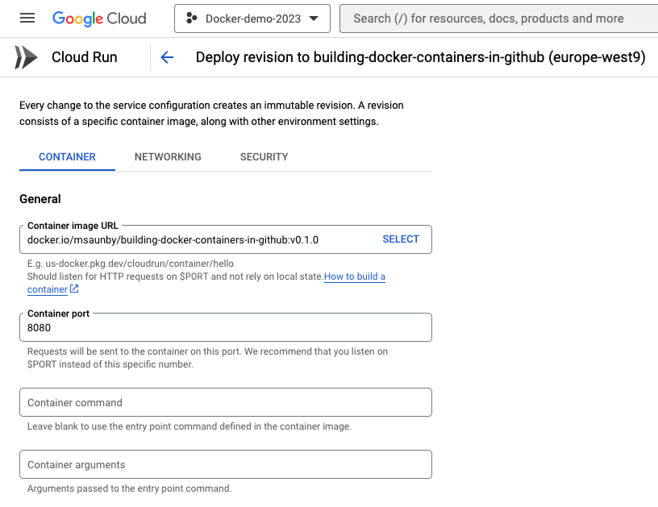
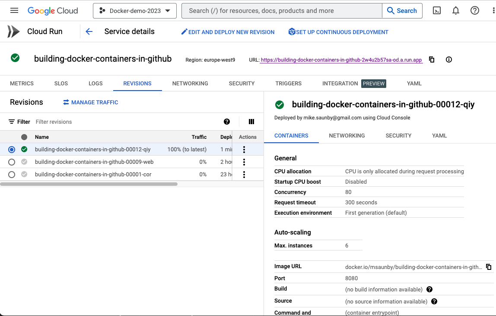

<!-- The reveal.js default style is good for small screens, but I like to get a bit more content in each slide
so I've made the fonts smaller, and when I want titles in capitals I'll write them in CAPITALS. -->
<style>
			.reveal p {
      	font-size: 0.65em;
				text-transform: None;
				text-align: left;
    		}
			.reveal h2 {
				font-size: 1.2em;
				text-transform: None;
				text-align: center;
			}
			.reveal h3 {
				font-size: 1.0em;
				text-transform: None;
				text-align: left;
			}
			.reveal code {
				font-size: 0.65em;
			}
</style>	
## Building Docker containers in GitHub

* What are containers?

* Deployment

* Project repository

* The Dockerfile

* Docker build

* GitHub Actions

* Container registry

* Deploy (Google Cloud)

* What next?


## What are containers?

Containers are packaged applications that can be run anywhere Docker is available. Docker containers are "lightweight" and can be started very quickly. Sophisticated web services can be built by orchestrating many containers. 


<https://docs.docker.com/get-started/overview/>


## Deployment

For this example we will build one container providing a Python **flask** web server. The project source files are hosted in GitHub. We're also going to need a hosting service to run our container and a *container registry*.


## Project repository

As we are going to deploy directly from a Git repository on GitHub all dependencies must be included in the repo.  For a Python project this means a Pip requirements file together with our source files. We also need a Dockerfile.

```sh
__main__.py
static/*
templates/*
requirement.txt
Dockerfile
```


## The Dockerfile

The Dockerfile describes how to build the container and, optionally, the command to run. Docker is programming language agnostic, so we need to specify the language tools
we need, Python and Pip, and the libraries.  This is typically done be choosing an
appropriate base image.

```yaml
# Base Image
FROM python:3.11-slim-bullseye
# Working Directory
WORKDIR /app
# Install packages from requirements.txt
COPY requirements.txt /app/
RUN pip install --no-cache-dir --upgrade pip &&\
    pip install --no-cache-dir --trusted-host pypi.python.org -r requirements.txt
# Copy source code to working directory
COPY flaskserver /app/flaskserver
# Command to run
CMD ["python", "flaskserver"]
```


## Docker build

The Dockerfile is a configuration file for the **docker build** tool. Each instruction in the Dockerfile adds additional layers to the base image. Docker build produces a lot of output, like this -

```sh
Run docker build . --file Dockerfile --tag my-image-name:$(date +%s)
Sending build context to Docker daemon  7.893MB

Step 1/7 : FROM python:3.11-slim-bullseye
3.11-slim-bullseye: Pulling from library/python
bb263680fed1: Pulling fs layer
43900b2bbd7f: Pulling fs layer
...
---> 79e97cd43c08
Step 3/7 : COPY requirements.txt .
 ---> 7c1c862a25e9
Step 4/7 : RUN pip install --no-cache-dir --upgrade pip &&    pip install --no-cache-dir --trusted-host pypi.python.org -r requirements.txt
 ---> Running in e4113ad35f0f
Requirement already satisfied: pip in /usr/local/lib/python3.11/site-packages (22.3.1)
Collecting pip
  Downloading pip-23.0-py3-none-any.whl (2.1 MB)
...
```


## GitHub Actions

The output in the last slide was copied from a report generated automatically by GitHub. These are produced when a GitHub Action runs.

GitHub Actions are automated workflows that use containers to build, test and deploy software. Here's an action to build a Docker container.

```yaml
name: Docker Image CI
on:
  push:
    branches: [ "main" ]
  pull_request:
    branches: [ "main" ]
jobs:
  build:
    runs-on: ubuntu-latest
    steps:
    - uses: actions/checkout@v3
    - name: Build the Docker image
      run: docker build . --file Dockerfile --tag my-image-name:$(date +%s)
```


## Container registry

A registry provides secure storage of container images with version control based on the tags given to images when pushed. The default container registry is Docker Hub. As we are building our container on GitHub a free Docker Hub account is sufficient. 




## Deploy

Deploying a container is very simple, we just tell the hosting service the URL of the image to deploy.




## Deploy (Google Cloud)

<https://building-docker-containers-in-github-2w4u2b57sa-od.a.run.app>




## Live demo

* GitHub pull-request already submitted

* Approve the pull-request

* GitHub action builds and pushes the new image

* Manually update the deployed version in Google Cloud

Typically the last step is also automated, and there would be automated tests of the code before building the container.


## Docker pull and Docker run

```sh
$ docker run -p 5000:5000 flask-demo
```


## What next?

### Google Cloud Shell

### Containers as development environments

### Docker Compose and Kubernetes


Typically containers build on base images that provide a complete run time environment for the programming language used by the application. Where something more bespoke is needed then we can build on base images such as **ubuntu:22.04** and use a package manager to install libraries and tools. e.g.
```yaml
FROM ubuntu:22.04
RUN apt update && apt install -y --no-install-recommends r-base
```
