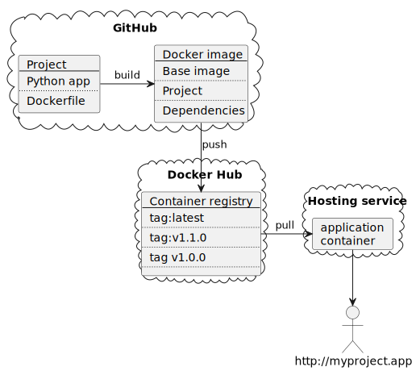

## Building Docker containers in GitHub

* What are containers?

* Deployment

* Project repository

* The Dockerfile

* docker build

* docker run

* GitHub Actions

* Deploy (Google Cloud)

* What next?


## What are containers?


<https://docs.docker.com/get-started/overview/>


## Deployment




## Project repository

As we are going to deploy directly from the repository all dependencies must be included.

```
__main__.py
requirement.txt
```


## The Dockerfile

The Dockerfile describes how to build the container and, optionally, the command to run. 

```yaml
# Base Image
FROM python:3.11-slim-bullseye
# Working Directory
WORKDIR /app
# Install packages from requirements.txt
COPY requirements.txt /app/
RUN pip install --no-cache-dir --upgrade pip &&\
    pip install --no-cache-dir --trusted-host pypi.python.org -r requirements.txt
# Copy source code to working directory
COPY flaskserver /app/flaskserver
# Command to run
CMD ["python", "flaskserver"]
```


## ```docker build```

```sh
# In a directory with a Dockerfile
$ docker build . -t flask-demo:latest
[+] Building 1.3s (11/11) FINISHED                                                                                    
 => [internal] load build definition from Dockerfile                                                             0.0s
 => => transferring dockerfile: 37B                                                                              0.0s
 => [internal] load .dockerignore                                                                                0.0s
 => => transferring context: 2B                                                                                  0.0s
 => [internal] load metadata for docker.io/library/python:3.11-slim-bullseye                                     1.2s
```


## GitHub Actions

```yaml
name: Docker Image CI
on:
  push:
    branches: [ "main" ]
  pull_request:
    branches: [ "main" ]
jobs:
  build:
    runs-on: ubuntu-latest
    steps:
    - uses: actions/checkout@v3
    - name: Build the Docker image
      run: docker build . --file Dockerfile --tag my-image-name:$(date +%s)
```


## ```docker run```

```sh
$ docker run -p 5000:5000 flask-demo
```


## What next?

### Google Cloud Shell

### Containers as development environments

### Docker Compose and Kubernetes


Typically containers build on base images that provide a complete run time environment for the programming language used by the application. Where something more bespoke is needed then we can build on base images such as **ubuntu:22.04** and use a package manager to install libraries and tools. e.g.
```yaml
FROM ubuntu:22.04
RUN apt update && apt install -y --no-install-recommends r-base
```
