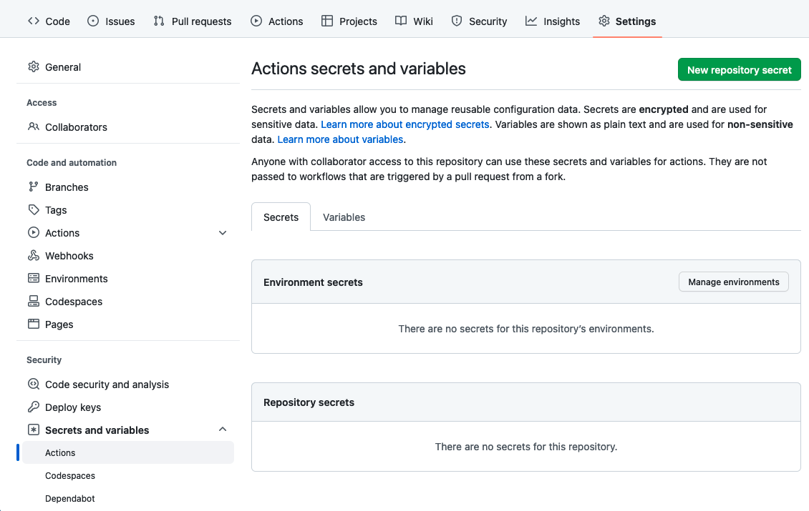

Building a Docker image in a GitHub action is very simple, however generating an appropriately tagged image and authenticating and pushing to a container registry is more complicated.

For this example I use the GitHub container registry, which avoids having to set secret variables as we can get the username and password using -
 
```
username: ${{ github.actor }}
password: ${{ secrets.GITHUB_TOKEN }}
```

To use Docker Hub, use -

```
username: ${{ secrets.DOCKER_HUB_USERNAME }}
password: ${{ secrets.DOCKER_HUB_ACCESS_TOKEN }}
```

And set a secret in the repository settings.

